# Retail_Analysis

*In this final project, we partnered with Anthropologie, a retail store, to analyze a portion of their customer base. It is important to note that the given retail dataset is not reflective of the company as a whole and all identifying features have been anonymized.*

## Purpose

The goal of this project is to make predictions about a customer based on previous behaviors and demographic features. The analysis performed should answer the question:

* Can customer lifetime purchase be accurately determined based on certain buying behaviors, demographic and aggregate features? If the answer is yes, which features are most important in the model prediction? 

We chose this topic because it is currently of interest to the Anthropologie team. In their words “how can Anthropologie occupy more of a customer's closet space?” We then chose to re-interpret the Anthropologie team’s question to more specifically look at the LIFETIME-DEMAND-AMOUNT column of the dataset. 

## Links

- Project Slides: [Slide Link](https://docs.google.com/presentation/d/1t2-KWQom2fe83HFV_6Ij2cqNIqFPrRmsQRdB6cvJqaQ/edit?usp=sharing)
- Tableau: [Link to tableau](https://public.tableau.com/views/RetailAnalysis-Anthropologie/Story1?:language=en-US&publish=yes&:display_count=n&:origin=viz_share_link)

## Process

- Perform exploratory analysis on demographic features
- Determine how demographics can be used to segment the customer base and their overall importance to customer lifetime demand. 
- Determine how demographics and previous behavior affect a customer’s lifetime demand by using machine learning models to predict customer spend.
- Anaylze features most important to the model

## Resources

- Python version 3.9, Pandas, Matplotlib, SQLAlchemy, SkLearn, US Zip Code, Tableau, pgAdmin4, SQL

## The Data 

When we approached the Anthropologie team about what data they would be willing to share with us, we weren’t 100% sure what types of data that they would be willing to share with us due to data privacy and confidentiality requirements. We gave them a list of fields and data types that we ideally wanted our dataset to have, but we were flexible with their constraints and how the data may come to us, i.e. one CSV or many CSVs.

The dataset acquired spans across 3 years. It included information on the customer, like what the customer ordered such as price, department, and order quantity, their order history, and their demographics. For privacy purposes, the dataset is not included in this repository.

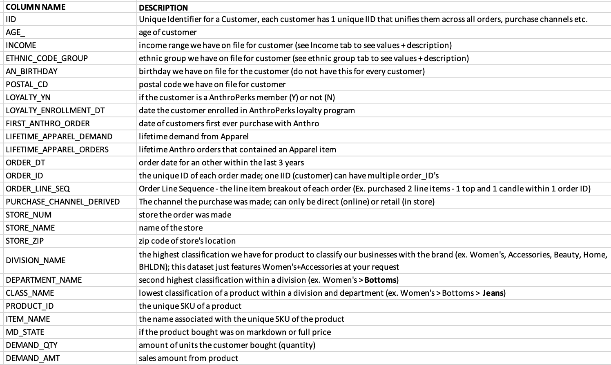

## Data Cleaning

The dataset was cleaned using Pandas. Data types were changed to DATETIME for the following columns: ORDER_DT, FIRST_ANTHRO_ORDER, and AN_BIRTHDAY. Null values were removed or replaced with the categorical data such as adding “DIRECT” to the STORE_ZIP column if an order was Direct. LOYALTY_ENROLLMENT_DT was only included for a small percentage of rows and was dropped from the dataset. This resulted in the cleaned dataset called data.csv.

## Database

A customer database was created in pgAdmin4 from the original data set. It was broken up into multiple tables including the complete data, a table of ethnicity codes, and a table or income brackets. We recognize that this database ERD is unrealistic, and that is because we received the data already joined by the Anthropology team.

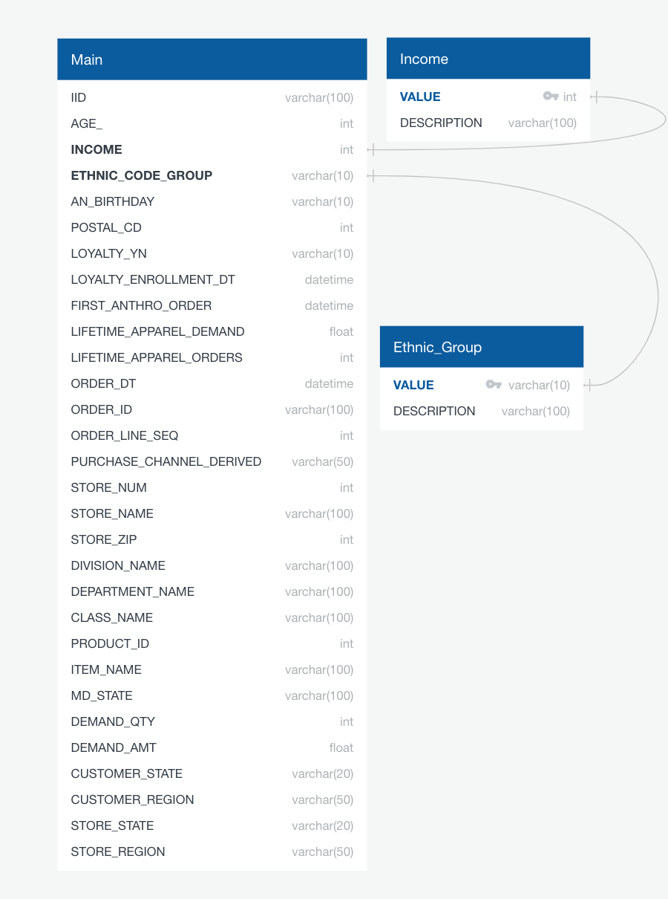

In an ideal setting, the customer database would be representative of how a company might utilize it. Pictured below is the expected database for a retailer. This database contains far more tables that interact on different primary keys. The relationships between the tables could be used to run SQL queries identifying patterns and trends in consumer behavior.

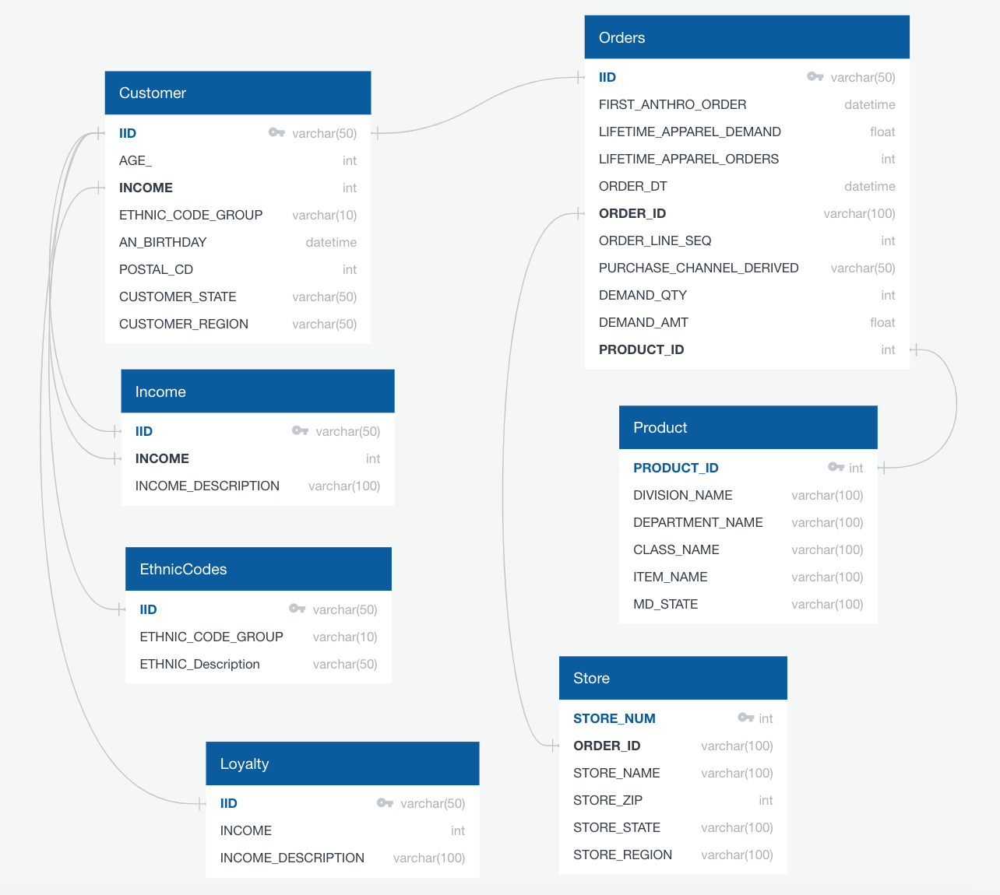

## Demographic Exploratory Analysis

Initial analysis to identify potential groupings that might affect customer demand was performed by looking at pivot tables and summaries of the data frame. After further investigation, there was an opportunity to explore the relevance of four customer demographic features including: Age, Location, Income, and Ethnicity. The four features were analyzed separately in order to evaluate how they individually affected total customer demand. Multiple graphs and charts were created to understand each demographic's impact on customer spend. Additional visualizations were created within Tableau.  [Link to tableau](https://public.tableau.com/views/RetailAnalysis-Anthropologie/Story1?:language=en-US&publish=yes&:display_count=n&:origin=viz_share_link)

#### Age Analysis

- Total customer spend can be visualized with a scatter plot and shows some obvious outliers.

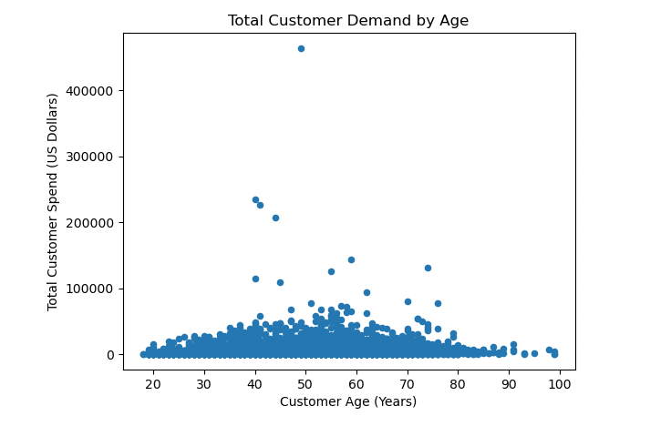 

- The outliers can be removed, and a more general customer can be analyzed by visualizing customer spend below $100,000.

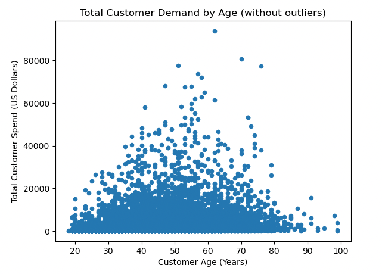

- Customer ages were put into buckets for easier analysis: < 30 years old, 31-40 years old, 41-50 years old, 51-60 years old, 61-70 years old, 71-80 years old, 80+ years old.
- The age group with the highest average lifetime demand was 71-80 years old

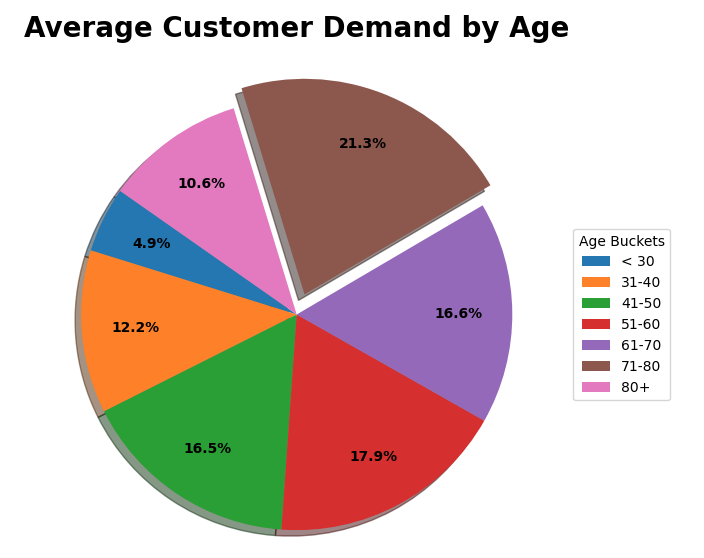

- The age group with the highest total lifetime demand was 41-50 years old.

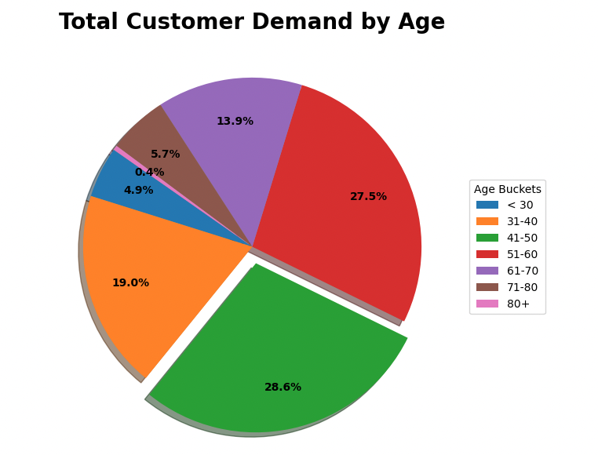

- One group that could be potentially targeted for growth is the “under 30 years old” customer group, who are barely represented in the sales data.

#### Income Analysis

- The income brackets with the highest concentration of Anthropologie customers are between $75,000 and $124,999 a year as well as customers with incomes $200,000 and above. Customers making less than $75k a year are uncommon. People making between $125k and $200k are also less likely to shop at Anthropologie.

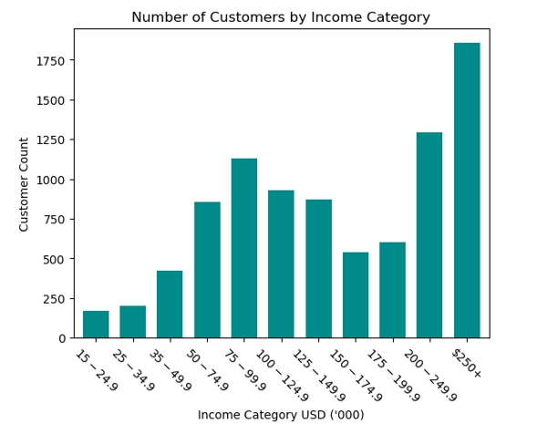
- Most Anthropologie customers make more than 100k annually.

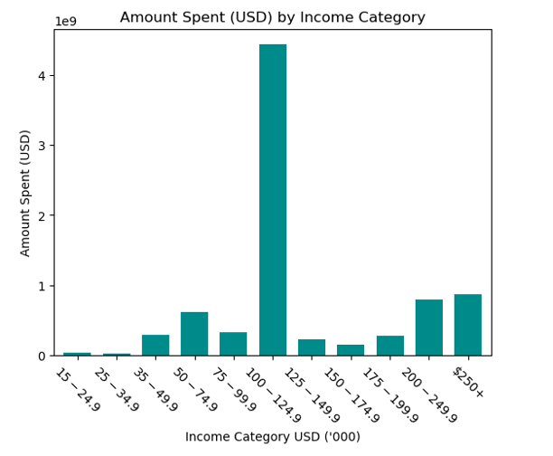
- The income bracket with the highest lifetime spending was $100,000-$124,999.

#### Location Analysis

In order to perform the analysis on customer location, the uszipcode library was imported to convert the POSTAL_CD zips codes to states. The list of converted states was appended onto the end of the DataFrame, and the states were grouped into the following regions:
- South: TX, OK, AR, LA, MS, AL, FL, GA, SC, NC, VA, DC, MD, DE, WV, KY, TN
- West: HI, AK, CA, OR, WA, MT, ID, NV, AZ, NM, CO, UT, WY
- Midwest: ND, SD, NE, KS, MN, IA, MO, WI, IL, IN, MI, OH
- Northeast: PA, NY, VT, ME, NH, MA, CT, RI, NJ
- Other: AE, AP

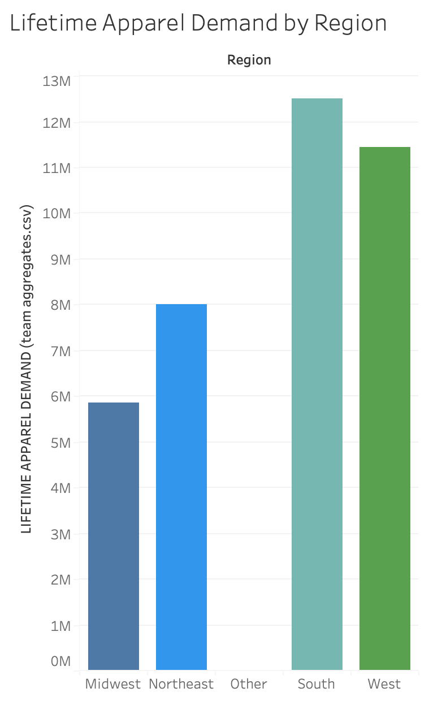

The initial table created was a bar plot looking at lifetime demand compared to a customer’s region, pictured above. The region with the highest lifetime apparel demand amount was the South at $12,500,818.04 followed by the West. 

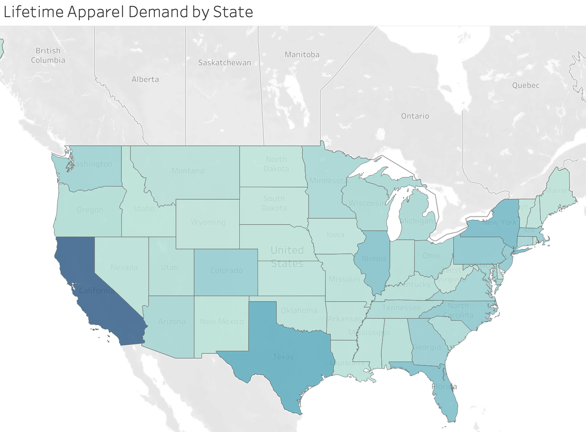

Additional charts and pivot tables were created using Tableau, above, and Python to examine other trends with customer state and region. Other discoveries made included: 
- California had the highest demand in both demand and quantity followed by Texas, New York, and Illinois.
- The Region with the highest number of unique customer IDs was the South with 46,139.
- All regions see a dramatic increase in demand from October to December and a drastic dip in January to February, likely due to the holiday season.
- All regions experience an increase in demand during the month of May. Further analysis could show if this is due to Mother’s Day.
- States with top demand include in descending order: California, Texas, New York, Illinois, Florida, and Pennsylvania. 
- Mark down business out performs full price in all Regions from January until October. After October full price business out performs markdowns in all regions. Further analysis could show if this is due to the holiday season.

#### Ethnicity Analysis

The Ethnicity with the highest lifetime demand was Western European, “K”, at 24,429,177 followed by Mediterranean, “E”, at 4,114,130. The lowest ethnicity group for lifetime demand was Native American at $21,004. While Western Europeans dominate the overall lifetime demand, there is opportunity to attract other ethnic groups and grow their demand.

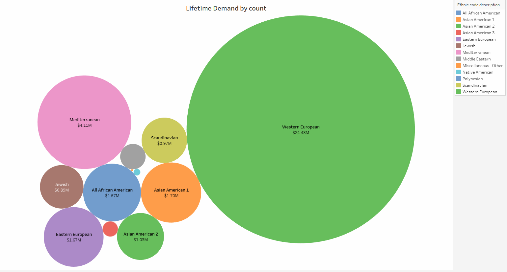

U.S. population is important to consider when analyzing this data as well. Population and Ethnicity are strongly correlated. The U.S. Census Bureau states the US is composed of about 70 percent Caucasian Americans, about 12 percent African Americans, about 4 percent Asian Americans, almost 13 percent Hispanics and almost one percent Native Americans. This gives us insight to why our charts show Western Europeans dominating in Lifetime demand.
Source: "Human Pursuit of Happiness in the World of Goods". MYCBBOOK.COM © Open Mentis 2013.

## Machine Learning Model

### Machine Learning Preprocessing Steps
- The model chosen to predict our target variable of Lifetime Customer was a Random Forest Regression. This model uses ensemble learning, meaning it trains multiple weak learners then combines their predictions before training more weak learners. This leads to a more robust model that is less susceptible to erroneous data. We chose this model because it is good at predicting continuous values, like our target variable, future lifetime customer demand. 
- Originally the cleaned, raw data was used to train and fit the model. However, we realized that there were multiple rows per IID (customer) which was inflating the values for lifetime customer demand. To account for this, a new dataset was created with only the most recent values for 'LIFETIME_APPAREL_DEMAND', 'AGE_', 'INCOME', 'ETHNIC_CODE_GROUP', 'LOYALTY_YN', 'states', and 'Region’. 
- Aggregate columns for Customer Spend (min, max, mean, and median for order dollars and quantities), percent direct orders vs in-store, and the average time between each order were created per customer ID. These aggregate columns were combined with the IID (customer ID) dataset so only relevant data was included in the model. 
- Categorical data was changed into numeric data using sklearn Ordinal Encoder, and we created a random integer column to use a baseline for feature importance. If a feature was less important than the random integer column, they were dropped from the feature set and the model was re-run. 

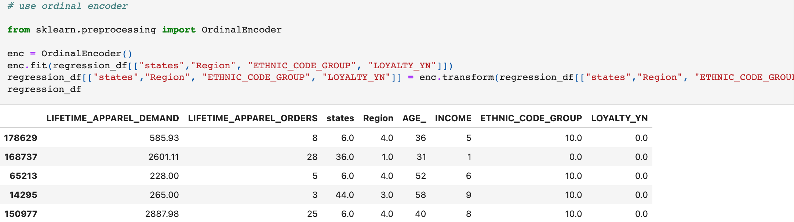 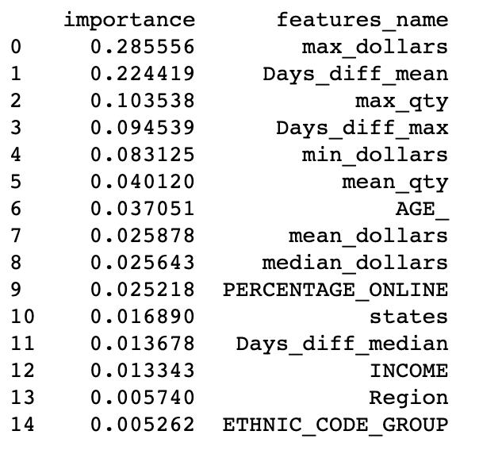

In every model, the features that had the most impact on the model’s performance were:
- Max_dollars= .286 This is the maximum dollar amount spent by a customer. 
- Day_diffe_mean = .224 This is the mean amount of days between purchases for a customer.
- Max_qty= .104 This is the max amount of items a customer bought in one purchase.
- Days_diff_max =.095 This is the maximum number of days between a customer purchasing.
- Min_dollars = .083 This is the minimum dollar amount spent by a customer.

### Optimization and Results
Since a regression model was used, the best way to interpret the model's performance was using metrics such as the R2, mean absolute value, and mean squared error. Throughout the process the model saw improvements. It began with the initial model:

In the initial machine learning, with all features included the results were:

- R2: 0.580
- Mean Absolute Error: 2443.92
- Mean Squared Error: 63252742.06

The second model used the random integer method to determine which features were least important to the model and could be dropped. The results for this model were:

- R2 0.5815
- Mean Absolute Error: 2449.4579
- Mean Squared Error:63082664.539

In the third model, XGBoost was applied to see if there would be any improvement. XGBoost is another form of ensemble learning where learners are trained on residual errors of previous learners. This provides stronger importance to misclassified observations and reduces overall error in the model. The results had the best R2 however the mean absolute error was not as low as the previous two renditions:

- R2 0.5996
- Mean Absolute Error: 2605.140
- Mean Squared Error: 60348918.512:

After further analysis it was determined that the model was being influenced by significant outliers. A rule was established to drop any values that were greater than three standard deviations away from the mean value. It was determined that an outlier was any data point above 3 standard deviations above the mean for the cleaned dataset. This rule was applied to both the Random Forest Regression and the XGBoost model. The Random Forest Regression saw improvement in its R2 while XGBoost experienced a decrease. Both models showed improvements in their mean absolute error. Next the hyper-parameters were tuned using Grid Search with Cross Validation to select the optimal parameter values. This produced our top models.

The Random Forest Model saw significant improvement: 

- R2: .595
- Mean Absolute Error: 1875.56
- Mean Squared Error: 9748631.88

XGBoost Model results after tuning:

- R2: .568
- Mean Absolute Error: 1959.36
- Mean Squared Error: 10390825.21

Tableau was utilized to further explore and visualize the relationship between the top important features in the machine learning model compared to customer lifetime demand.  [Link to tableau](https://public.tableau.com/views/RetailAnalysis-Anthropologie/Story1?:language=en-US&publish=yes&:display_count=n&:origin=viz_share_link)

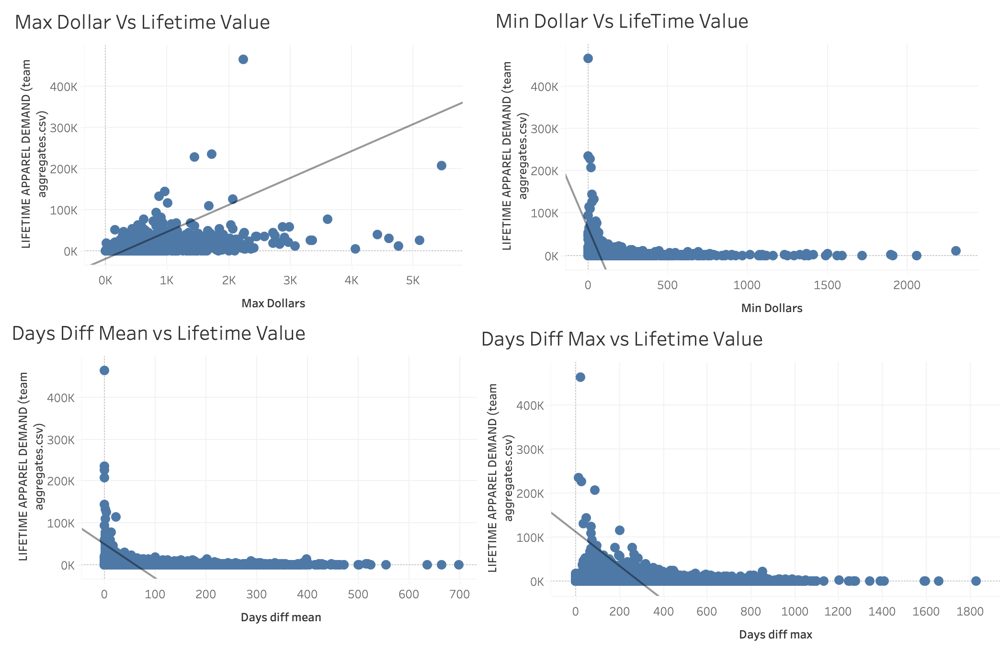

### Summary

In summary the best performing Model was the Random Forest Regression with hyperparameter tuning resulting in the lowest mean absolute error. The features that held the most importance to the model were 
Max_dollars, Day_diffe_mean, Days_diff_max, Max_quantity and Min_dollars. Based on these features and their relationship to Customer Lifetime Demand, customers with higher max dollar spend, higher minimum value spend, higher maximum quantity of items purchased, low mean difference of time between purchases and low max time between purchases tend to have higher lifetime value while the inverse had a lower lifetime demand.

Key takeaways to improve customer lifetime demand would be to consider:
- How to get customers to spend more by dollar and units per transaction? This could include targeted email marketing or suggestive selling at a store level.
- How to decrease the mean and max number of days between purchases? This could include providing incentives to buy now like limited time promotion or at a store level forming meaningful relationships with the customer that keep them coming back.

## Retrospective

### What We Would Do Differently
The first thing we would have done differently is we would have improved our initial data cleaning by running aggregate/summary statistics on all of the columns of the raw data. This would have given us a better idea of the shape of our data and determine if the raw data contained any obvious outliers. We didn’t realize that we had duplicated rows for each customer ID until the second week of the project which meant that some of our initial analysis needed to be reworked before we ran our machine learning models.

Another thing we would have done differently is explicitly state group expectations to help us hold one another accountable throughout the project. For example, we could have discussed what methods of communication worked best for our group, such as email, text, or Slack, and then defined communication expectations. Clarifying our preferred communication method early on could have helped us reduce miscommunications drastically. 

### Recommendations for Future Analysis
If we had more time, we would use K-means clustering on the most important features in our dataset. This analysis would segment customers into groups of higher value versus lower value customers that could be helpful in a targeted marketing campaign. 

In addition, if we had more time, we would try to predict the next six months or so of purchases for the top 25% of customers identified within our dataset. This would then, ideally, be compared to the real order data of the top 25% to see if the model was accurate. 

### Bibliography 
https://towardsdatascience.com/hyperparameter-tuning-the-random-forest-in-python-using-scikit-learn-28d2aa77dd74
https://www.datasource.ai/uploads/1e5660e1137e60077935fc8c1b92578e.html
https://medium.com/@ugursavci/customer-lifetime-value-prediction-in-python-89e4a50df12e
https://towardsdatascience.com/predicting-next-purchase-day-15fae5548027
https://blog.devgenius.io/how-to-predict-customer-lifetime-value-using-machine-learning-in-python-4066344d0ab0
https://github.com/woodthom2/predict_customer_spend/blob/master/PredictCustomerSpend.ipynb
https://scikit-learn.org/stable/modules/generated/sklearn.preprocessing.OrdinalEncoder.html

